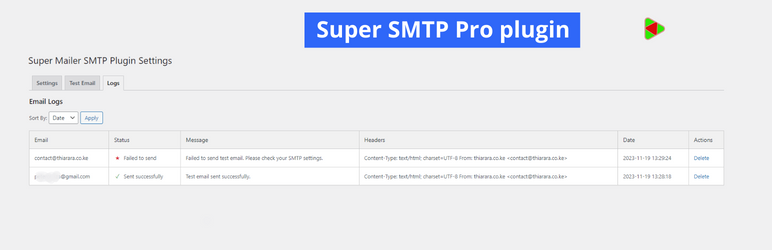
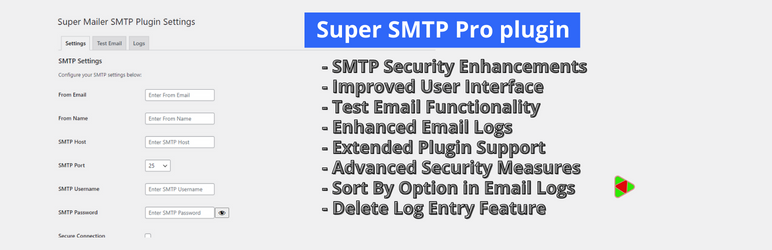
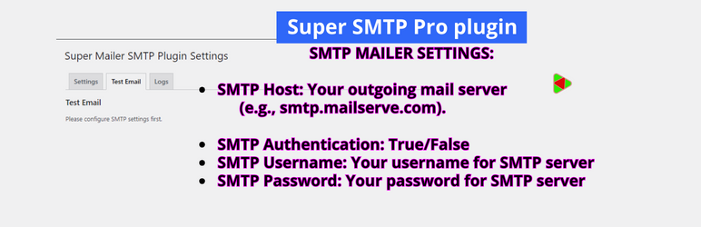
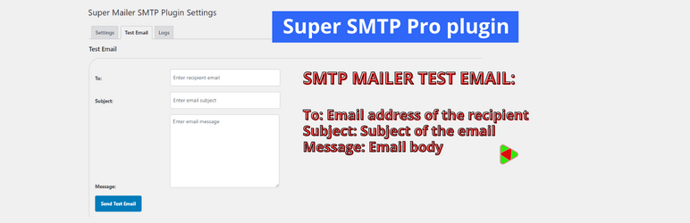

# Super-SMTP

Enhance email delivery reliability through SMTP with the Super SMTP Plugin. Configure your mail server effortlessly and enjoy advanced security features.

## Table of Contents
- [Screenshots](#screenshots)
- [Key Features](#key-features)
- [SMTP Mailer Settings](#smtp-mailer-settings)
- [SMTP Mailer Test Email](#smtp-mailer-test-email)
- [Known Compatibility](#known-compatibility)
- [Installation](#installation)
- [Changelog](#changelog)
- [Documentation](#documentation)
- [Contributing](#contributing)
- [Security Policy](#security-policy)
- [License](#license)

## Screenshots
1. Main Banner

2. Screenshot 1

3. Setting Page

4. Test Mail 1

5. Test Mail 2

## Key Features
- **SMTP Security Enhancements:** Fortified the security of SMTP settings for even more secure email communications.
- **Improved User Interface:** Enhanced user interface for intuitive configuration of SMTP settings.
- **Test Email Functionality:** Easily send test emails to validate your SMTP settings with confidence.
- **Enhanced Email Logs:** Keep track of your email communications with detailed and updated email logs.
- **Open Source Commitment:** Super SMTP Plugin remains open source, demonstrating our commitment to the WordPress community.
- **Extended Plugin Support:** Now supports additional plugins like Contact Form 7, Jetpack Contact Form, Visual Form Builder, Fast Secure Contact Form, Formidable Forms, and Contact Form by BestWebSoft for seamless integration and enhanced functionality.
- **Advanced Security Measures:** Added more security features and measures to safeguard your email communications.
- **Sort By Option:** Added the ability to sort email logs by date or status.
- **Delete Log Entry:** Users can now delete specific email log entries directly from the settings page.

## Installation
1. Go to [Super SMTP Plugin](https://thiarara.co.ke/product/super-smtp/) to download the plugin.
2. Go to the Add New plugins screen in your WordPress Dashboard.
3. Click the upload tab.
4. Browse for the plugin file (`super-smtp.zip`) on your computer.
5. Click "Install Now" and then hit the activate button.

## Plugin Setup
1. After activating the Super SMTP plugin, navigate to your WordPress Dashboard.
2. Look for the "Settings" menu on the left-hand side.
3. Click on "Super SMTP" to access the plugin settings.
4. Configure the necessary SMTP settings such as server address, port, username, and password.
5. Save the changes.
Now, your WordPress site should be configured to use the Super SMTP settings for sending emails. Make sure to test the email functionality to ensure everything is set up correctly.

## SMTP Mailer Settings
- **SMTP Host:** Your outgoing mail server (e.g., smtp.gmail.com).
- **SMTP Authentication:** Whether to use SMTP authentication when sending an email (True/False). If you choose to authenticate, you will also need to provide your username and password.
- **SMTP Username:** The username to connect to your SMTP server.
- **SMTP Password:** The password to connect to your SMTP server.
- **Type of Encryption:** The encryption to be used when sending an email (TLS/SSL/No Encryption. TLS is recommended).
- **SMTP Port:** The port to be used when sending an email (587/465/25). If you choose TLS, the port should be set to 587. For SSL, use port 465 instead.
- **From Email Address:** The email address to be used as the From Address when sending an email.
- **From Name:** The name to be used as the From Name when sending an email.

## SMTP Mailer Test Email
Once you have configured the settings, you can send a test email to check the functionality of the plugin.
- **To:** Email address of the recipient.
- **Subject:** Subject of the email.
- **Message:** Email body.

## Known Compatibility
Super SMTP Plugin should work with any plugin that uses the WordPress Mail function. However, it has been tested with the following form and contact form plugins:
- Contact Form 7
- Jetpack Contact Form
- Visual Form Builder
- Fast Secure Contact Form
- Formidable Forms
- Contact Form by BestWebSoft

## Frequently Asked Questions (FAQ)

### Q: What is Super SMTP?
**A:** Super SMTP is a WordPress plugin that enhances email functionality by allowing you to configure and use a custom SMTP server for sending emails from your WordPress site.

### Q: Why do I need to use SMTP with WordPress?
**A:** Using SMTP (Simple Mail Transfer Protocol) ensures reliable email delivery by connecting your WordPress site to a mail server. This can help avoid common email delivery issues and improve the chances of emails reaching recipients' inboxes.

### Q: How do I obtain SMTP server details?
**A:** You can obtain SMTP server details from your email hosting provider. Typically, you'll need information such as the server address, port, and authentication credentials (username and password).

### Q: Can I use Super SMTP with any hosting provider?
**A:** Yes, Super SMTP is designed to work with most hosting providers. However, it's essential to check your hosting provider's policies and ensure they allow SMTP configuration.

### Q: What should I do if I encounter issues with email delivery?
**A:** If you face problems with email delivery, double-check the SMTP settings in the plugin configuration. Ensure that the provided server details and credentials are accurate. If issues persist, contact your hosting provider's support for assistance.

### Q: Is Super SMTP compatible with other email plugins?
**A:** Compatibility may vary depending on the specific functionalities of other plugins. It's recommended to test Super SMTP with other plugins and check for any conflicts. Most commonly, Super SMTP works well alongside other plugins.

### Q: Can I use Super SMTP for transactional emails?
**A:** Yes, you can use Super SMTP for transactional emails, such as order confirmations and password resets. Configuring a reliable SMTP server enhances the delivery of important transactional emails.

Feel free to reach out to our support if you have additional questions or encounter any issues.

## Changelog
### 3.0.2
- **Bug Fix:**
  - Fixed a security-related bug that could potentially expose sensitive information.
  - Fixed My Plugin added button.

### 3.0.1
- **Test Email Functionality:** Easily send test emails to validate your SMTP settings with confidence.
- **Bug Fix:**
  - Resolved an issue with the test email functionality not working as expected.
  - Fixed a bug where the toggle to view the password was not functioning correctly.
  - Addressed a sorting issue for encryption options.
- **UI/UX Updates:**
  - Changed user interface for a more visually appealing and user-friendly experience.
  - Improved the appearance and layout for better usability.
- **Security Update:**
  - Implemented additional security measures to enhance the overall security of the plugin.

### 3.0.0
- **Bug Fix:** Fixed a security-related bug that could potentially expose sensitive information.

### 2.15.16
- **Bug Fix:**
  - Fixed a security-related bug that could potentially expose sensitive information.
  - Fixed My Plugin added button.

### 2.15.13
- **Test Email Functionality:** Easily send test emails to validate your SMTP settings with confidence.
- **Bug Fix:**
  - Resolved an issue with the test email functionality not working as expected.
  - Fixed a bug where the toggle to view the password was not functioning correctly.
  - Addressed a sorting issue for encryption options.
- **UI/UX Updates:**
  - Changed user interface for a more visually appealing and user-friendly experience.
  - Improved the appearance and layout for better usability.
- **Security Update:**
  - Implemented additional security measures to enhance the overall security of the plugin.

## Documentation
**Guidance and Notices:**
- For SSL encryption, consider using port 465 for secure connections.
- If port 465 is blocked, you can use port 587 with TLS encryption.
- For TLS encryption, consider using port 587 for secure connections.
- For STARTTLS encryption, consider using port 587 for secure connections.
- For non-secure connections, port 25 is commonly used.
- Alternatively, you can use port 2525 for non-secure SMTP on alternate ports.

**Test Email:**
To test your configuration, use the test email functionality provided in the settings. 
Fill in the recipient's email address, subject, and email body to ensure your SMTP settings are working correctly.

## Contributing

Please read [CONTRIBUTING.md](CONTRIBUTING.md) for details on our code of conduct, and the process for submitting pull requests to us.

## Security Policy

For details on our security policy, vulnerability reporting, and bug bounty program, please read [SECURITY.md](.github/SECURITY/SECURITY.md).

## License

This project is licensed under the GPL-2.0 License - see the [LICENSE](LICENSE) file for details.
#
